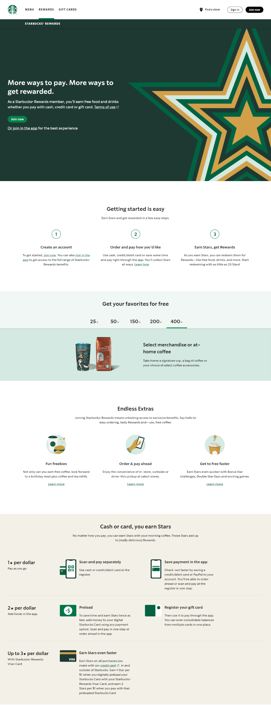

# Starbucks

## Rewards page.
Can you recreate it?
[starbucks](https://www.starbucks.com/rewards)

## What will you learn?
1. Sticky/fixed header
2. Tabbed sections
3. Color choices
4. Layout practice
5. and more!

## Color Palette:
1. #1e3932
2. #008248
3. #d4e9e2
4. #f1f8f6
5. #f3f1e7
6. #000000

## Resources:
[How To Create a Hero Image](https://www.w3schools.com/howto/howto_css_hero_image.asp)
[Create a Fixed Header on Scroll](https://www.w3schools.com/howto/howto_js_sticky_header.asp)
[Create Toggleable Tabs](https://www.w3schools.com/howto/howto_js_tabs.asp)
[Create a Skip to Content link](https://css-tricks.com/how-to-create-a-skip-to-content-link/)

## Reference Image (in case the site does not open):
