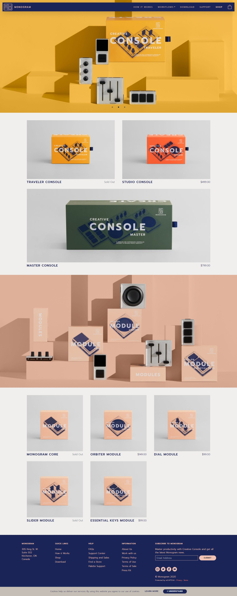

# Monogram

## Rewards page.
Can you recreate it?
[monogramcc](https://monogramcc.com/shop/)

## What will you learn?
1. Hero image slider.
2. Image hover transitions
3. Dropdown menu
4. Menu hide/appear on scroll
5. and more!

## Color Palette:
1. #1a2456
2. #ff8b68
3. #ff501c
4. #f0efed
5. #080b1b

## Resources:
[How To - Slideshow](https://www.w3schools.com/howto/howto_js_slideshow.asp)
[Change image on hover.](https://sirv.com/help/articles/hover-change-image/)
[Hide Menu on Scroll](https://www.w3schools.com/howto/howto_js_navbar_hide_scroll.asp)
[A Complete Guide to Flexbox](https://css-tricks.com/snippets/css/a-guide-to-flexbox/)

## Reference Image (in case the site does not open):
